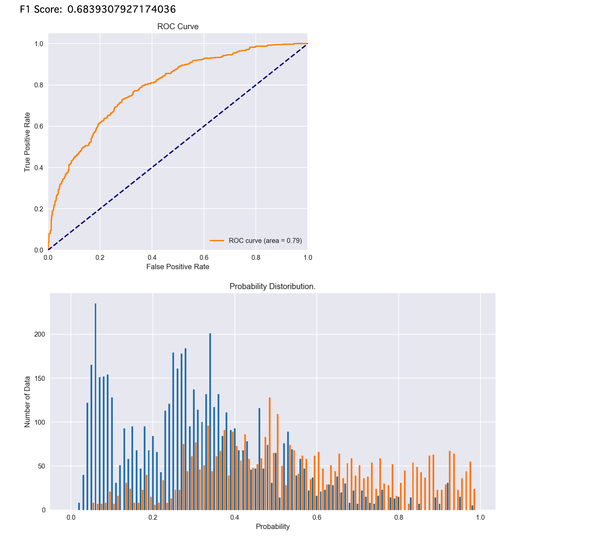
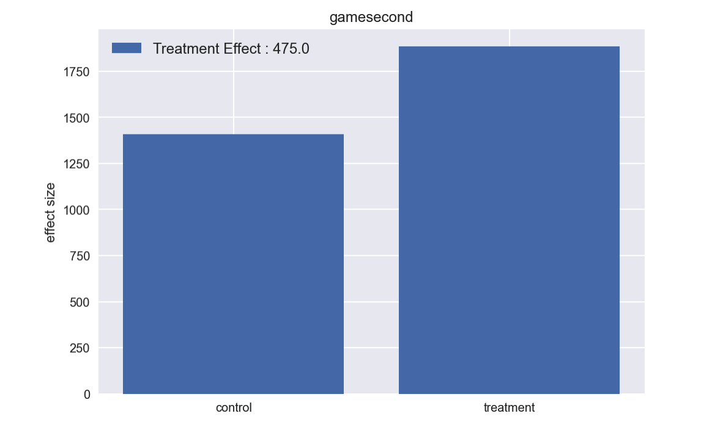

# pycalf

## Installation
```
$ pip install pycalf
```


## Quick Start
### Inference with IPW
```
from pycalf import metrics
from pycalf.propensity_score import IPW

# Load Data and Define Variables
df = pd.read_csv('sample/q_data_x.csv')
covariate_cols = [
    'TVwatch_day', 'age', 'sex', 'marry_dummy', 'child_dummy', 'inc', 'pmoney',
    'area_kanto', 'area_tokai', 'area_keihanshin', 'job_dummy1', 'job_dummy2',
    'job_dummy3', 'job_dummy4', 'job_dummy5', 'job_dummy6', 'job_dummy7',
    'fam_str_dummy1', 'fam_str_dummy2', 'fam_str_dummy3', 'fam_str_dummy4'
]
outcome_cols = ['gamecount', 'gamedummy', 'gamesecond']
treatment_col = 'cm_dummy'


X = df[covariate_cols]
y = df[outcome_cols]
treatment = df[treatment_col].astype(bool).to_numpy()

# Define and Fit IPW Model.
learner = Pipeline([
    ('sclaer', preprocessing.MinMaxScaler()),
    ('clf', LogisticRegression(solver='lbfgs', max_iter=1000, random_state=42))
])
model = IPW(learner)
model.fit(X, treatment)

# metrics
print('F1 Score: ', metrics.f1_score(treatment, model.get_score(), threshold='auto'))
metrics.plot_roc_curve(treatment, model.get_score())
metrics.plot_probability_distribution(treatment, model.get_score())

# Estimate ATE
outcome_name = 'gamesecond'
z0, z1, treat_effect = model.estimate_effect(
    X, treatment, y[outcome_name].to_numpy().reshape(-1, 1), mode='ate')
metrics.plot_treatment_effect(outcome_name, z0[0], z1[0], treat_effect[0].round())
```
<div align="center">
  
  
</div>


## References
### Documentation
